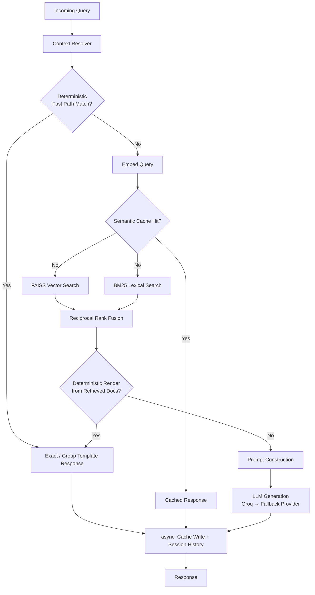

<div align="center">


**Production-oriented, low-latency Bangla retrieval-augmented generation system for conversational product search and catalog Q&A.**

*দাম কত? · নুডুলস বিক্রি করেন? · মিল্কভিটা দুধ কত লিটার?*

</div>

---

## Overview

SpeaklarRAG answers natural-language Bangla questions about a product catalog by running a **two-speed architecture**: a deterministic fast path for factual lookups that skips the embedder, vector store, and LLM entirely — and a full hybrid RAG pipeline (FAISS + BM25 → RRF → LLM) as a fallback for everything else.

The common case — exact price, brand, size, and existence questions — stays well under **10ms**. Open-ended conversational queries fall through to retrieval + generation, typically completing in **70–85ms** depending on the LLM provider.

---

## Architecture



### Two answer paths

| Path | Triggers | Stages skipped |
|---|---|---|
| **Deterministic hot path** | Exact price / brand / size / category · product-group existence · price-range · context-resolved follow-ups | Embedder · FAISS · BM25 · Semantic cache · LLM |
| **Retrieval + LLM fallback** | Open-ended · ambiguous · unsupported-attribute queries | — (full pipeline) |

Session history writes are dispatched as **fire-and-forget async tasks** after the response is computed — Redis is never on the critical path.

---

## Request Flow

### Deterministic path
```
request → context resolver → session context lookup → deterministic responder
        → template response → [async] cache write + session update
```

### Fallback RAG path
```
request → context resolver → session context lookup → deterministic miss
        → embed query (pre-warmed singleton) → semantic cache lookup
        → FAISS + BM25 (parallel) → RRF fusion
        → deterministic render attempt → LLM generation (primary → fallback)
        → [async] cache write + session update
```

---

## Project Structure

```text
speaklar_rag/
├── api/
│   ├── main.py              # FastAPI app, lifecycle, REST + WebSocket endpoints
│   ├── pipeline.py          # End-to-end RAG orchestrator (per-stage latency tracing)
│   └── middleware.py        # Request IDs, latency headers, Redis-backed rate limiting
├── context/
│   ├── resolver.py          # Bangla coreference resolution & follow-up rewriting
│   ├── rewriter.py          # Query rewriting utilities
│   └── ner.py               # Regex-based Bangla product NER (no ML, <5ms)
├── generation/
│   ├── deterministic.py     # Intent detection, exact/grouped catalog lookups
│   └── generator.py         # Prompt builder + multi-provider LLM facade
├── retrieval/
│   ├── embedder.py          # Singleton multilingual-E5 embedder (ONNX-first)
│   ├── faiss_store.py       # Cosine-similarity vector search + disk persistence
│   ├── bm25_store.py        # Bangla BM25 lexical search + disk persistence
│   ├── cache.py             # Two-tier semantic cache (in-process + Redis)
│   ├── embedding_cache.py   # Redis-backed embedding cache
│   └── fusion.py            # Reciprocal rank fusion (RRF)
├── session/
│   └── store.py             # Redis-backed session history & structured target context
├── indexer/
│   └── pipeline.py          # Offline normalization, enrichment, index build
├── utils/
│   ├── logger.py            # Structured JSON application logging
│   ├── metrics.py           # Rolling in-memory metrics + Prometheus export
│   ├── tracing.py           # Request tracing helpers
│   └── product_metadata.py  # Brand / category / pack-size enrichment
├── data/
│   ├── products.csv         # Product catalog (Bangla)
│   ├── products.json        # Enriched product catalog
│   └── generate_mock_data.py
├── prometheus/
│   └── prometheus.yml       # Prometheus scrape config
├── tests/                   # Pytest suite — unit, pipeline, latency
├── bootstrap.py             # Environment checks & quickstart smoke test
├── benchmark.py             # Latency / correctness benchmark
├── config.py                # Pydantic settings (env-driven)
├── Dockerfile               # Multi-stage build with ONNX pre-bake
├── docker-compose.yml       # Redis + API + Prometheus + Grafana
├── Makefile
└── requirements.txt
```

---

## Core Components

<details>
<summary><b>API Layer</b></summary>

- **`api/main.py`** — Lifespan-managed startup: connects Redis, preloads the embedder, loads or builds FAISS and BM25 indexes, initializes semantic cache and LLM generator, constructs `RAGPipeline`. Exposes REST, WebSocket, health, readiness, and metrics routes.
- **`api/pipeline.py`** — The `RAGPipeline` orchestrator. Implements the staged flow with per-stage latency instrumentation: `context_ms`, `exact_lookup_ms`, `embed_ms`, `cache_ms`, `retrieval_ms`, `fusion_ms`, `template_ms`, `llm_ms`, `total_ms`.
- **`api/middleware.py`** — Adds `X-Request-ID` and `X-Latency` headers; applies Redis-backed rate limiting.

</details>

<details>
<summary><b>Context & Conversation State</b></summary>

- **`context/resolver.py`** — `BanglaContextResolver` detects short follow-up turns (e.g. `"দাম কত টাকা?"`) and rewrites them using entities stored from the previous turn.
- **`context/ner.py`** — Pure regex/lookup-based Bangla product entity recognizer. No ML model; stays within a low single-digit-millisecond latency budget.
- **`session/store.py`** — Redis-backed conversation history, last-mentioned entities, and structured "target context" used to resolve follow-ups.

</details>

<details>
<summary><b>Deterministic Answer Engine</b></summary>

- **`generation/deterministic.py`** — `DeterministicResponder` answers directly from in-memory catalog data: exact product lookups, grouped product-type existence/price-range answers, and follow-up resolution using stored target context. This is what allows the system to skip embedding, retrieval, and LLM calls entirely for factual queries.

</details>

<details>
<summary><b>Retrieval Stack</b></summary>

- **`retrieval/embedder.py`** — `EmbedderSingleton` wraps `intfloat/multilingual-e5-small` (384-dim), loaded once at startup via ONNX Runtime (fallback: PyTorch), capped at 64 tokens for short product queries.
- **`retrieval/faiss_store.py`** — Cosine-similarity vector search with index persistence.
- **`retrieval/bm25_store.py`** — BM25 lexical search tuned for Bangla text, persisted to disk.
- **`retrieval/fusion.py`** — Reciprocal rank fusion combining FAISS and BM25 result sets.
- **`retrieval/cache.py`** — Two-tier `SemanticCache`: in-process cosine-similarity layer + Redis exact-match layer. Similarity threshold is deliberately set high (default ~0.98) — Bangla price queries share near-identical surface structure across different products, making a lower threshold cause false cache hits.

</details>

<details>
<summary><b>Generation & Observability</b></summary>

- **`generation/generator.py`** — `LLMGenerator` provides a unified async interface over Groq, OpenAI, and Gemini with primary/fallback routing and per-provider timeouts.
- **`utils/metrics.py`** — Rolling in-memory metrics with Prometheus text export at `/metrics` and JSON snapshot at `/metrics/json`.
- **`utils/logger.py`** — Structured JSON logging with request IDs, session IDs, latency breakdowns, and coreference flags.

</details>

---

## Product Resolution Policy

The deterministic responder distinguishes **exact** queries from **product-group** queries to avoid returning one arbitrarily-chosen SKU's price for a broad question.

| Query type | Resolution | Example |
|---|---|---|
| Exact product | Single exact answer | `মিল্কভিটা নুডুলস ৫০০ গ্রাম দাম কত?` → `৫৬ টাকা` |
| Narrowed group | Narrowed grouped answer | Brand + product type without size |
| Broad product group | Price-range answer | `নুডুলসের দাম কত?` → `৫৬ থেকে ৪১৬ টাকা` |
| Existence query | Yes/no template | `নুডুলস বিক্রি করেন?` → `হ্যাঁ, বিক্রি করা হয়।` |
| Unsupported attribute | Deterministic "unavailable" or fallback | — |
| Open-ended / subjective | LLM (retrieval + generation) | `ভালো নুডুলস কোনটা?` |

---

## Getting Started

### Prerequisites

- Python 3.10+
- Redis
- At least one LLM provider key: `GROQ_API_KEY` (recommended), `OPENAI_API_KEY`, or `GEMINI_API_KEY`

### Installation

```bash
git clone https://github.com/Rhythm05Roy/speaklar_rag.git
cd speaklar_rag

python -m venv .venv
source .venv/bin/activate

pip install -r requirements.txt
cp .env.example .env   # then fill in your keys
```

### Start services

```bash
# Redis only
docker-compose up -d redis

# Full stack (Redis + API + Prometheus + Grafana)
docker-compose up -d
```

### Build indexes

```bash
python indexer/pipeline.py --data-path ./data/products.csv --index-dir ./data/indexes
```

### Run the API

```bash
uvicorn api.main:app --host 0.0.0.0 --port 8000 --reload
# or
make run
```

---

## Configuration

All settings are Pydantic `BaseSettings` in `config.py`, loaded from environment variables or `.env`:

```bash
# LLM Providers
GROQ_API_KEY=           GROQ_MODEL=llama-3.1-8b-instant
GEMINI_API_KEY=         GEMINI_MODEL=gemini-2.0-flash
OPENAI_API_KEY=         OPENAI_MODEL=gpt-4o-mini
LLM_PRIMARY=groq        LLM_FALLBACK=openai

# Redis
REDIS_URL=redis://localhost:6379/0
REDIS_CACHE_TTL=3600
REDIS_SESSION_TTL=3600

# Semantic Cache
CACHE_SIMILARITY_THRESHOLD=0.98   # Deliberately high — see Known Limitations
SEMANTIC_CACHE_MAX_ENTRIES=2000

# Paths
DATA_DIR=./data
INDEX_DIR=./data/indexes

# Flags
ENABLE_CACHE=true
ENABLE_MONITORING=true
LOG_LEVEL=INFO
```

`Settings.validate_startup()` asserts at boot that at least one LLM key is set, `REDIS_URL` is present, and `LLM_PRIMARY` is a valid provider.

---

## API Reference

### `POST /query`

```json
// Request
{ "query": "নুডুলসের দাম কত?", "session_id": "demo-session" }

// Response
{
  "session_id": "demo-session",
  "request_id": "4aa74369",
  "query": "নুডুলসের দাম কত?",
  "response": "নুডুলসের দাম ৫৬ টাকা থেকে ৪১৬ টাকা পর্যন্ত।",
  "coref_resolved": false,
  "cache_hit": false,
  "retrieved_docs": [
    { "name": "রাধুনী নুডুলস ১ কেজি", "price": 110, "score": 0.0323, "sources": ["faiss", "bm25"] }
  ],
  "latencies": {
    "context_ms": 2.1, "exact_lookup_ms": 1.4, "embed_ms": 0.0,
    "cache_ms": 0.0, "retrieval_ms": 0.0, "fusion_ms": 0.0,
    "template_ms": 1.4, "llm_ms": 0.0, "total_ms": 4.3
  }
}
```

Response headers: `X-Cache-Hit`, `X-Coref-Resolved`

### Other endpoints

| Method | Endpoint | Purpose |
|--------|----------|---------|
| `GET` | `/health` | Liveness — Redis stats + cache statistics |
| `GET` | `/readiness` | Readiness — confirms FAISS + BM25 indexes loaded |
| `GET` | `/metrics` | Prometheus text-format metrics |
| `GET` | `/metrics/json` | JSON rolling 5-minute metrics snapshot |
| `DELETE` | `/session/{session_id}` | Clear session history + context |
| `WS` | `/ws` | Bidirectional streaming (`token` / `done` / `error`) |

> **WebSocket note:** The current implementation streams the final response word-by-word — not true provider-native token streaming.

---

## Example Conversations

**Context-aware follow-up**
```
Q1: আপনাদের কোম্পানি কি নুডুলস বিক্রি করে?
A1: হ্যাঁ, নুডুলস বিক্রি করা হয়।

Q2: দাম কত টাকা?     ← 3-word follow-up, no explicit subject
A2: নুডুলসের দাম ৫৬ টাকা থেকে ৪১৬ টাকা পর্যন্ত।
    ↳ Resolved from Q1 context. No embedding, retrieval, or LLM call.
```

**Exact product lookup**
```
Q: মিল্কভিটা নুডুলস ৫০০ গ্রাম দাম কত?
A: মিল্কভিটা নুডুলস ৫০০ গ্রামের দাম ৫৬ টাকা।
   ↳ Deterministic hot path. total_ms ≈ 3–5ms.
```

**Open-ended fallback**
```
Q: ভালো নুডুলস কোনটা?
A: [retrieval + LLM-generated response]
   ↳ Full RAG pipeline. total_ms ≈ 70–85ms.
```

---

## Performance Model

### Deterministic path — target: single-digit ms

Applies to exact lookups, group queries, and follow-ups. **No embedder, FAISS, BM25, or LLM call.**

### Retrieval + LLM path — typical: 70–85ms

| Stage | Approx. |
|-------|---------|
| Context resolution | ~3ms |
| Semantic cache lookup | ~2ms |
| Query embedding | ~3ms |
| FAISS + BM25 (parallel) | ~5ms |
| RRF fusion | <1ms |
| Prompt construction | <1ms |
| LLM generation | ~55–70ms |
| **Total** | **~70–85ms** |

LLM latency dominates and varies by provider, model, and network.

---

## Observability

Ships with a full Prometheus + Grafana stack via `docker-compose`:

| Service | Port |
|---------|------|
| Redis | `127.0.0.1:6379` |
| API | `8000` |
| Prometheus | `127.0.0.1:9090` |
| Grafana | `127.0.0.1:3000` |

Structured logs include request IDs, session IDs, per-stage latency breakdowns, intent classifications, and coreference flags — enabling full correlation across logs and metrics.

---

## Testing

```bash
# Full suite with coverage
pytest tests/ -v --cov=. --cov-report=term-missing

# If DEBUG env var causes config issues
DEBUG=false pytest tests/ -v
```

```text
tests/
├── test_context.py        # Coreference resolution & query rewriting
├── test_deterministic.py  # Exact / grouped catalog answer logic
├── test_generator.py      # Prompt building & LLM provider facade
├── test_latency.py        # Latency budget assertions
├── test_llm_fallback.py   # Primary → fallback provider behavior
├── test_pipeline.py       # End-to-end orchestration
└── test_retrieval.py      # FAISS / BM25 / RRF fusion
```

Additional scripts: `bootstrap.py` (smoke test), `benchmark.py` (latency + correctness), `validate_static.py` (import/config regression checks).

---

## Docker & Deployment

```bash
docker-compose up -d
```

**Dockerfile highlights:**
- **Multi-stage build** — pre-bakes ONNX-exported `multilingual-e5-small` into the image, eliminating a ~70s export-on-startup delay
- **Non-root execution** — runs as a dedicated `speaklar` user
- **Single worker** — `--workers 1` keeps embedding-model memory predictable; scale horizontally via multiple containers
- **`uvloop`** event loop for lower-overhead async I/O
- Redis unavailability degrades gracefully to in-memory behavior rather than hard failing

---

## Known Limitations

- Group-level answers are primarily implemented for existence and price-range queries — not every conceivable group attribute is supported.
- WebSocket `/ws` streams final responses word-by-word; provider-native token streaming is not yet exposed.
- Deterministic accuracy depends on metadata quality extracted from semi-structured product names (`utils/product_metadata.py`).
- LLM fallback quality and latency depend on configured providers and external network conditions.

---

## License

MIT — see [`pyproject.toml`](pyproject.toml).

<div align="center">

**Built by [Ridam Roy](https://github.com/Rhythm05Roy)**

[](https://github.com/Rhythm05Roy)
[](mailto:ridam15-4260@diu.edu.bd)


</div>
